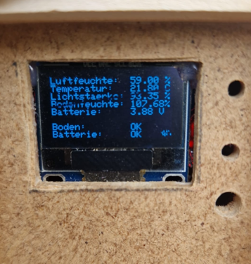

# Garden Automation System 

This project is a self-sufficient garden automation system based on an Arduino Nano. The device monitors important environmental parameters such as soil moisture, air humidity, temperature, and atmospheric pressure to provide detailed information about the garden’s conditions.

The system is powered by solar panels and operates autonomously using a 10,000 mAh 3.4 V battery, allowing long-term outdoor operation without external power sources. The collected sensor data can be used to optimize plant care and support efficient water management.

The project combines embedded programming, sensor technology, and renewable energy to create an intelligent and sustainable solution for automated garden monitoring.

-------------------------------------------------------------------------------------

PinOut:

Lightsensor  = A3     
SDA	 = A4
SCL	 = A5    								
D3     =	Buzzer						 		
D2     =	DHT11 Temperatur sensor

-------------------------------------------------------------------------------------

* Power Loading Signals:
* blue LED:  Full Battery
* rod LED:   in Charging Programm
